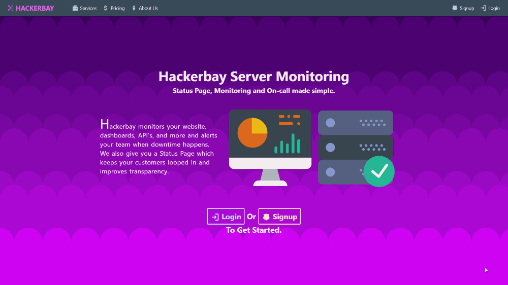

 

# **Hackerbay Server Monitoring Project - FrontEnd**

Hackerbay is a app that monitors your website, dashboards, API's and alerts your team when downtime happens. When the user logs in, user is navigated to dashboard and user can monitor and do configurations there.

This is the Frontend part of the Server Monitoring Project. Backend part of the project can be found on [Hackerbay - Backend.](https://github.com/SandunWebDev/hackerbay/)

See Live Demo at [HackerbayApp.ml](http://HackerbayApp.ml) that deployed in Google Clouds Kubernetes Engine.

  

---
## 	**Project Build Dashboards**

  This project use Travis CI/CD pipeline with Docker Containerization, Kubernetes and Automated Testing for Continues Deployment. 

- [Travis CI/CD Builds](https://travis-ci.com/SandunWebDev/hackerbay-frontend)
- [Docker Hub Images](https://cloud.docker.com/repository/docker/sandunwebdev/hb-frontend-image-prod)
- [Code Coverage](https://codecov.io/gh/SandunWebDev/hackerbay-frontend)
- [Cypress E2E Testing](https://dashboard.cypress.io/#/projects/k5bijp/runs)

---
## **Used Technologies**

| FrontEnd     | BackEnd                                                               | Tools                      | Other              |
| ------------ | --------------------------------------------------------------------- | -------------------------- | ------------------ |
| React        | See [Hackerbay - Backend](https://github.com/SandunWebDev/hackerbay/) | Jest + Enzyme + Sinon      | TravisCI + CodeCov |
| Redux        |                                                                       | StoryBook                  | Docker             |
| React Router |                                                                       | Cypress                    | Kubernetes         |
| Redux Froms  |                                                                       | ESLint + Prettier          | NginX              |
| Twilio API   |                                                                       |                            | Google Cloud Engine|
| BlueprintJS  |                                                                       |                            |                    |

---
## **How To Run**

### # USING KUBERNETES
- Get this projects Kubernetes Configs at [here](https://cloud.docker.com/repository/docker/sandunwebdev/hb-frontend-image-prod) and follow the instructions.

### # USING DOCKER
- Just run `npm run docker:dev:run`. It will install and run all the dependencies and services need to run this project. Then you can interact with the program through http://localhost:3000.

- Also already built "Docker Images" of this project can be found in [here].(https://cloud.docker.com/repository/docker/sandunwebdev/hb-frontend-image-prod).

### # USING NORMAL WAY
- Run `npm install` to install dependencies.
- Then run `npm start`.
- Then you can interact with program through http://localhost:3000.

NOTE : Make sure [Hackerbay Backend Server & Postgres Database Servers](https://github.com/SandunWebDev/hackerbay/) are already running for full comptability.

---
## **How To Test**

- `npm test` - All Tests.
- `npm run test:unitandintegration` - Unit & Integration Testing.
- `npm run test:storyhshots` - Structural Testing.
- `npm run test:imageshots:local` - Visual Testing.
- `npm run test:cypress:local` - E2E Testing.
- `npm run storybook` - Component Testing.

---
